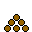

# citybuilder2.0

## how to play
The objective is to build your city. 
All buildings require money to create
you can collect money with the following:
- Collecting tax
- Selling materials you produced

that money can build:
- homes
- factories
- parks

All buildings generate tax for your city proportional to their price
### The sidebar
The sidebar is your cities control panel. is seperated into 4 sections
1) City stats (your city's money and population)
2) resources (your city's current materials)
3) Tax (your cities current tax per hour, tax avalible to collect, and buttons to collect tax and new materials)
4) Shop (includes sections with buildings avalible to purchase)
#### sidebar features
1) the resouces menu allows you to sell and convert your items

    By left clicking a resource you sell it's entire quantity
    By right clicking a resource you convert it into an evolved item for a $100 fee.
    
    examples
     left click -> $2
     right click -> -$100 

### definitions
Money: money is used to convert **resouces** into evolved resouces and to buy buildings.

Tax: An amount of **money** proportinal to the sum of all the prices of your products

Materials, Resouces: Products able to be collected every hour based on how many factories of that type have placed on your **game field**

Sidebar: an area occupying the right side of the window that allows you to manage various aspects of your city

Game field: The area left of your **sidebar** that shows your city

